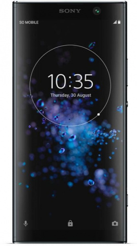

**sony xperia xa2 plus**

Фотографии, сделанные с помощью камеры Canon sony xperia xa2 plus.

---

Характеристики

| **ОСНОВНЫЕ ТЕХНИЧЕСКИЕ ХАРАКТЕРИСТИКИ**||
| ------------- | ------------- |
| **Размеры и вес**  | **157 х 75 х 9.6 мм, вес 205 грамм** |
| Материалы корпуса  | Пластик с металлическим напылением |
| Дисплей  | 6 дюймов, 2160 х 1080 точек, IPS, PPI 403, защитное стекло, олеофобное покрытие |
| Сеть  | 2G: 850/900/1800/1900 3G: 850/900/1700/1900/2100 4G: b3/b7/b20/b38 Две SIM-карты |

---

Примечания.

